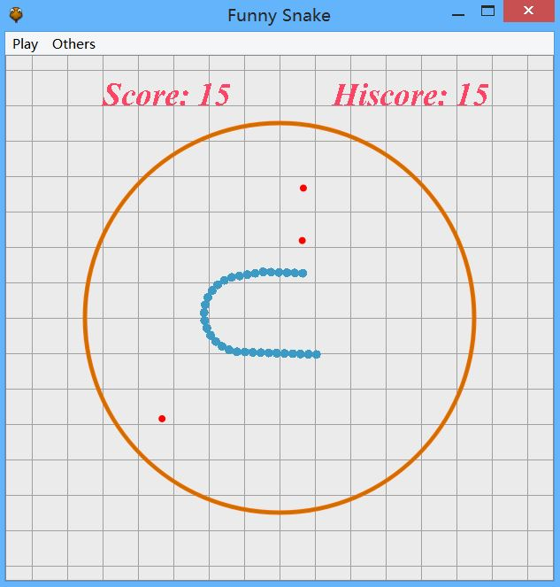

## funny snake 使用说明文档

### 应用程序信息
- 名称：Funny Snake
- 作者：Shallwe
- 日期：2018/10/27
- 当前版本：Beta
- 工程概况：一个基于Qt5制作的简单贪吃蛇游戏。

- - - - - - -  
### 工程说明

#### 使用版本
- Qt 5.11.2 (MSVC 2015 32bit)

#### 其它说明
- 使用Qt Creator打开工程运行即可。我用的IDE是Qt Creator 4.7.1。
- 该工程为练习项目，所以会比较粗糙。
- 参考教程：[《Qt 学习之路 2》](https://www.devbean.net/2012/08/qt-study-road-2-catelog/)
- 参考代码：https://github.com/devbean/snake-game

- - - - - - -  
### 游戏截图
  
 

- - - - - - -  
### 程序操作说明

#### 游戏规则
- 贪吃蛇游戏，不用怎么介绍都懂了吧~
- 墙做成了圆形，蛇也可以沿任意方向运动。
- 红色豆是普通豆（+1分），蓝色豆是特殊豆（+3分）。
- 吃蓝色豆有特殊效果：加速/减速/增加场上豆数量/增加自身长度/拐弯更灵敏。效果随机出现。
- 可以选择普通模式和困难模式，试试能得到多少分吧！

#### 键盘操作
- 标题界面
    - 按 `回车` 键进入游戏。
    - 按 `↑` 键和 `↓` 键选择模式。
- 游戏界面
    - 按 `↑` 键让蛇开始运动。
    - 按 `←` 键和 `→` 键让蛇改变方向。
- 游戏结束
    - 按 `回车` 键返回标题界面。

- - - - - - -  
### 修订记录
- Beta (2018/10/27)  
    - 测试版本。
